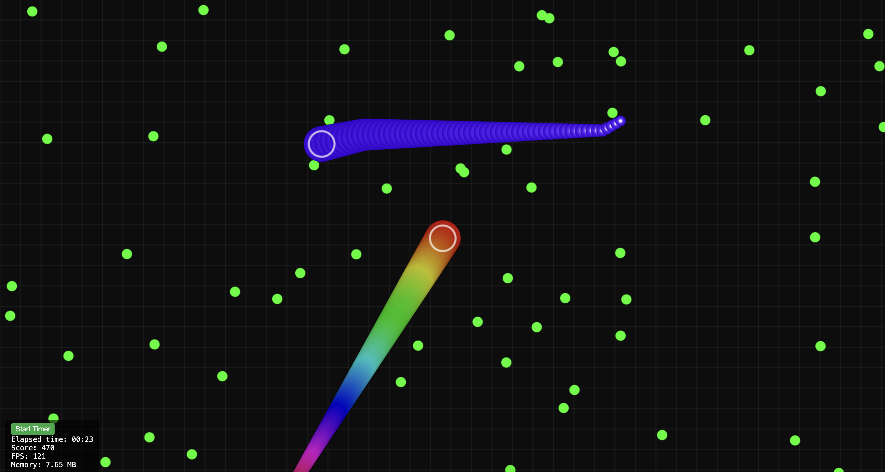

# Gulpy – Multiplayer Snake Game 🐍

A multiplayer-style snake game inspired by *Gulper.io*, built using **React** and the **HTML Canvas API**. Players and bots move inside a circular arena, leaving colorful trails as they glide.

---

## 🎮 Features

- Smooth snake movement following the mouse pointer
- Colorful, tapered snake tails
- Accelerate with left click
- Large circular arena (`radius: 3500px`)
- AI-controlled bots that move randomly and stay inside the arena
- Grid background for spatial awareness

---

## ⚙️ Settings

- Snake tail length: `100 segments`
- Movement speed:  
  - Normal: `2`  
  - Accelerated (on mouse down): `5`
- Snake head size: `25px`
- Snake tail width: `40px` (decreasing towards tail)
- Arena radius: `3500px`
- Number of bots: `5` (default)

---

## 🚀 Getting Started

### Prerequisites

- Node.js (v14 or later)
- npm or yarn

### Installation

```bash
git clone https://github.com/Mad-man-8/Gulpy.git
cd gulpy
npm install
```

### Run the game locally

```bash
npm start
```

Your game will be available at `http://localhost:3000`

---

## 🧠 Code Structure

- `App.tsx`: Main canvas and game loop
  - Player and bot movement
  - Collision logic (optional future feature)
  - Rendering: background, snakes, arena
- `useRef` and `requestAnimationFrame` for smooth animation
- Bots implemented as random walkers with directional inertia
- Boundary checking keeps bots and players inside the arena

---

## 📦 Build

```bash
npm run build
```

---

## 📸 Screenshots

> 

---

## 🛣️ Roadmap 

- ✅ Bots stay inside circular arena  
- ✅ Collision detection between player and bots 
- ✅ Add score tracking 
- ⬜ Multiplayer over WebSocket  
- ⬜ Skins/customization

---

## 📄 License

MIT © [Eshen]
